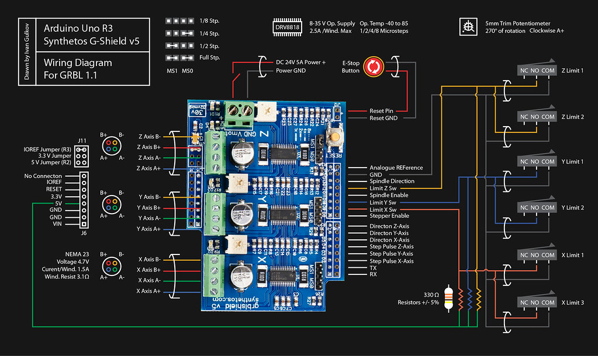
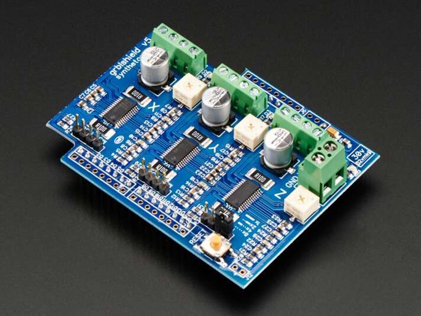
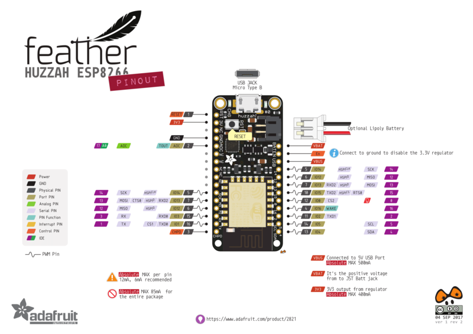
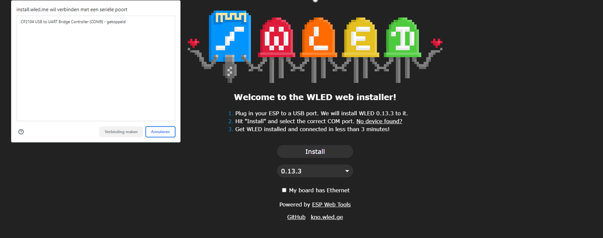
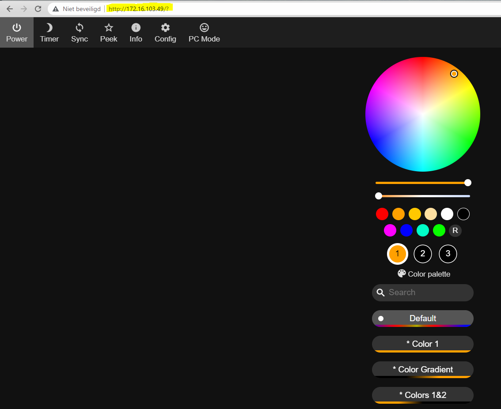
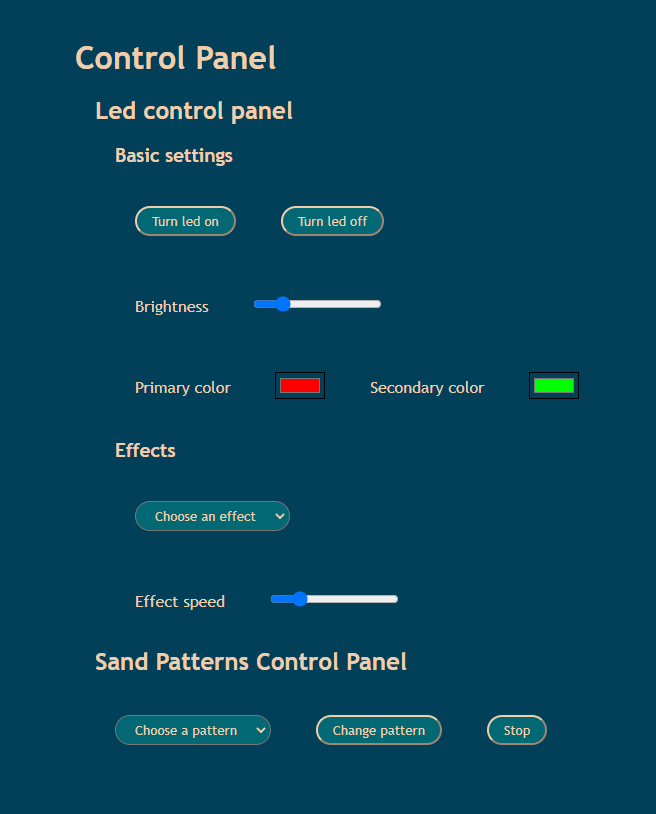

# Hardware Project Experience -- SAND-ART TABLE

## Project goal

Our assignment was to build a table similar to the "Sisyphus Magic Sand Coffee Table" that displays a sand art image via X-Y coordinates.

## Project Breakdown

## Mechanical/Physical

We used a 3D printer (Ultimaker) and removed the Z-axis controls. A grbl shield attached to an arduino interfaces with the stepper motors.
For the table itself we used a [Lack table](https://www.ikea.com/be/nl/p/lack-tafeltje-wit-gelazuurd-eikeneffect-70319028/#content) from Ikea. The sand itself is kept in a plexiglass tray. The ball is moved by magnets attached to the 3D printer and draws geometrical figures in the sand.
RGB leds add additional ambience and can also be controlled.

### End switches

To make sure the motors don't go beyond their bounds we had to implement end switches for the Y and X axis.
Connect the end switches to the gShield like in this schematic (you can just ignore the Z-axis).


**Dimensions**
48cm x 34cm

## Software

### Firmware

To control the 3D printer we used the [grbl library](https://github.com/grbl/grbl).
This is an alternative to more complex firmware like Marlin and runs on a vanilla Arduino (or any other model as long as it supports an Atmega 328).



To control the stepper motors we use the gShield v5b which is compatible with an Arduino uno.
To get the correct altered firmware on the Arduino execute the following steps:
If you cloned this repo go to the 'grbl-library' folder, extract the grbl.zip to C:\Users\[your user]\Documents\Arduino\libraries
Now open Arduino IDE (some newer versions of the IDE may cause trouble to execute the next steps, if trouble occurs I recommend using Arduino IDE 1.8.19)
Go to sketch->Include Library->Add .ZIP library... Now go to documents->Arduino->libraries and select the grbl folder, hit open.
To upload the file go to File->Examples->grbl->grblUpload.
Now you can compile and upload the file.

The grbl library is configured through serial communication, so the first step was to write a small program that writes and reads the Gcodes to and from the Arduino. This is the [sand_table.py](./webinterface/server/sand_table.py) file in the server map.

### debugging & GRBL settings

To debug and change the configuration of the GRBL library run the sand_table.py script in the server folder.

```pt

python sand_table.py

```

You should now see a command line where you can type your GCODE command directly.

type `$$` to see all the current configuration settings. For more info on what they mean visit the [grbl wiki](https://github.com/gnea/grbl/wiki).

Following commands are also defined and recognized:

- star (draws a star for testing)
- parse (draws a "clearfunction" that just scribbles over the sand)
- stop (does a hard reset on the arduino)
- kerst (draws a christmas tree)
- poly (draws a polygon)

CTRL + X cancels any command and stops it.
`$h` is the command for homing the table.

**IMPORTANT**
If by any chance the table enters its alarm state and will not move anymore with a nor.

### The sender and function class

These two files contain the main functionality for sending the correct Gcode commands to the arduino.
The function class contains a getX() and getY() method to give the sender class the necessary X/Y coordinates (and radius if circular movement is required).

## Webinterface

### IP addresses

Static IP address for the PI: 172.16.242.1
Static IP for the LED-strip: 172.16.242.2
Default gateway: 172.16.0.1

### LED connection

#### Pinout ESP8266

To connect the led-strip to the ESP8266 only 3 pins need to be connected: 3V3, GND and pin 2. Details can be found on the image below.


[source](https://www.google.com/url?sa=i&url=https%3A%2F%2Flearn.adafruit.com%2Fadafruit-feather-huzzah-esp8266%2Fpinouts%3Fview%3Dall&psig=AOvVaw0UI07aMuDnzTYrxg_ZGPF5&ust=1671271754257000&source=images&cd=vfe&ved=0CBAQjRxqFwoTCIiL6Mry_fsCFQAAAAAdAAAAABAU)

#### Connect to led-strip

When no static IP address has been setup, the connection with the led-strip had to be setup manually. To do this, follow the steps below:

* Connect the ESP8266 to a PC (or Raspberry Pi) and go to the [WLED install website](https://install.wled.me/).
* Click 'Install' and select the right port in the pop up window and connect.



* Then click "change Wi-Fi" and enter the network name and password and connect
* Then click continue and 'visit device'
* Now the WLED API opens with the default configurations and in the search bar you can find the IP address.



* Copy this IP address into the [script.js file](./static/client/script.js) in the 'const url' variable.

Now you are ready to change the LED effects from this webinterface!

If a static IP address has been set up, the only thing that is left to do is connect the ESP8266 to a power source.

### Client

A simple HTML/JS webpage has been made on which the user can control the functionalities of the Sand Table.



#### Led controls

All LED functionality is controlled via the webinterface. The user can turn the LED on or off, choose the brightness, primary and secondary colors, effect and effect speed. The javascript script behind the webpage sends a GET request to the WLED API to change all these parameters.

The led-strip is connected to an [ESP8266](https://en.wikipedia.org/wiki/ESP8266) so that it can be connected to the internet. Then we can send all kinds of GET requests to the WLED API to change the behavior of the LED-strip. Different types of parameters that are added in the URL for the GET request can change the behavior of the LED-strip. An overview of all changeable elements of the LED-strip can be found [here](https://kno.wled.ge/interfaces/http-api/). An overview of all effects to be be set can be found [here](https://github.com/Aircoookie/WLED/wiki/List-of-effects-and-palettes).

#### Sand patterns controls

Dependencies for the Sand Pattern controls are:

```pt

sudo python -m pip install scipy
sudo apt install python3-matplotlib python3-tk

```

To verify which USB port is in use: `dmesg | grep "tty"`
Then add that port in the [main.py file](./server/main.py) in the creation of the Sender object (here it's 'raspberry').

### Server

To initialize FastAPI:

[Source](https://github.com/tiangolo/fastapi)

```pt

sudo pip install fastapi
sudo pip install "uvicorn[standard]"

```

Start server:

When in the webinterface directory:

```pt

uvicorn server.main:app --reload

```

### Docker

To setup docker and docker-compose, run the following commands:

```pt

curl -sSL https://get.docker.com | sh
sudo adduser <user> docker
sudo systemctl enable docker
sudo systemctl start docker
sudo reboot

```

Test if docker is correctly installed with the `docker --version` command.

Then continue installation of docker  compose with:

```pt

sudo apt-get install libffi-dev libssl-dev
sudo apt install python3-dev
sudo apt-get install -y python3 python3-pip
curl https://sh.rustup.rs -sSf | sh
source "$HOME/.cargo/env"
rustup update
pip3 install setuptools_rust docker-compose

```

Check if docker-compose is correctly installed with the `docker-compose --version` and `docker ps` commands.

Build with the `docker-compose up --build` command.

Then you can surf to the IP address of the Raspberry Pi and access the webinterface.

## Ideas for future implementations

1. Letters & words could be written in the sand. Even better would be if this could be done with a touch screen (maybe this would be something for a future project).
2. The firmware should be able to take an image and draw the figure in the sand (or at least the crude outlines).

### Extra code

This is a section dedicated to the code that is available in this repo, but is not used in this project. This is code that can be used for different implementations.

#### Led-strip driver

This is a simple directory with a few functions that can drive the led-strip. There is a main file in which a few functions are called to change the look of the led-strip. In the src directory, in the [led.py](./led-strip-driver/src/led.py) file the functions can be found. This works with GET requests sent to the IP address of the led-strip. There is code that makes sure that values will go over the maximum values.

#### Sandtable package

This is the code for a PyPI package for the driver of the sand table. This was initially the idea to implement the code from the sand table in the web interface, but this did not work as desired. We have then decided to use a different approach (see above). The package has been created and can be downloaded, but does contain old code so may not work as it should.

This package can be installed with `python3 -m pip install vives-sandtable_package_zend`. Then in the file where you want to use the code: `vives-sandtable_package_zend import Sender`. Now you can use the code to change the patterns on every project you want.

Disclaimer: it is better to use the code in the [server directory](./webinterface/server/) as it is the most up te date.
