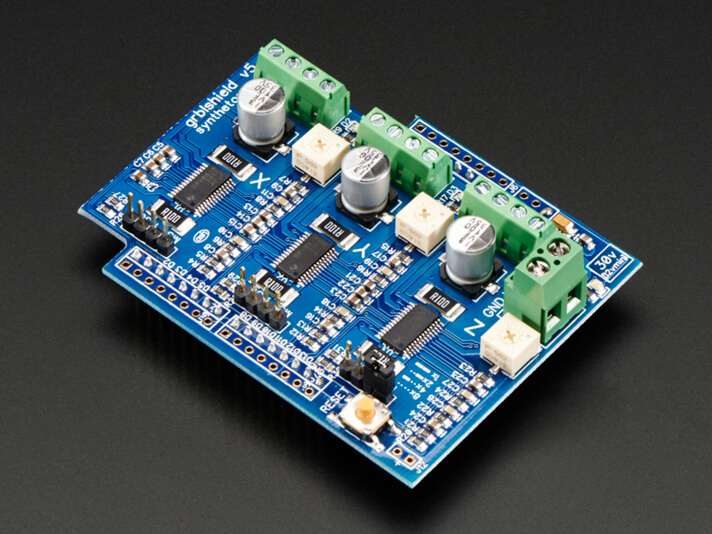
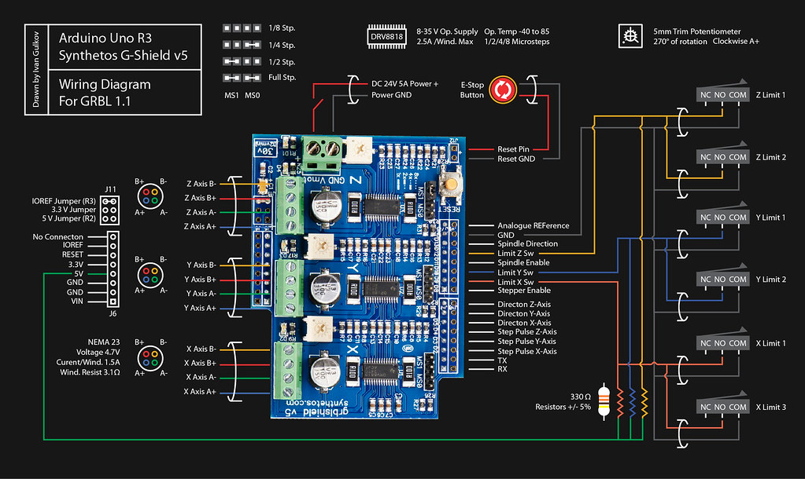
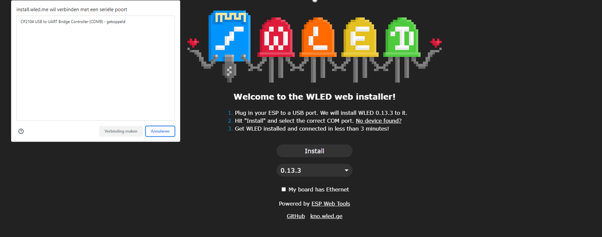
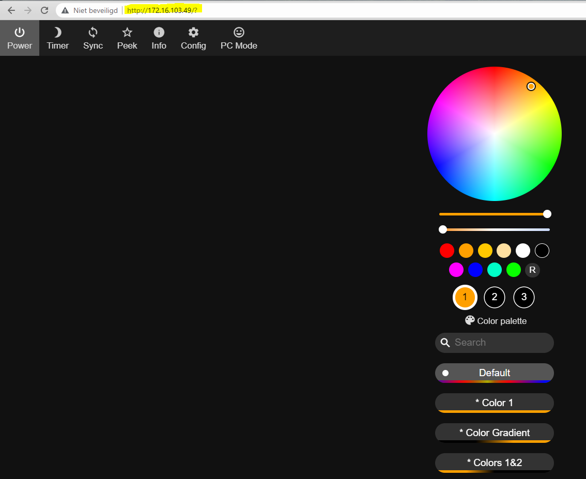
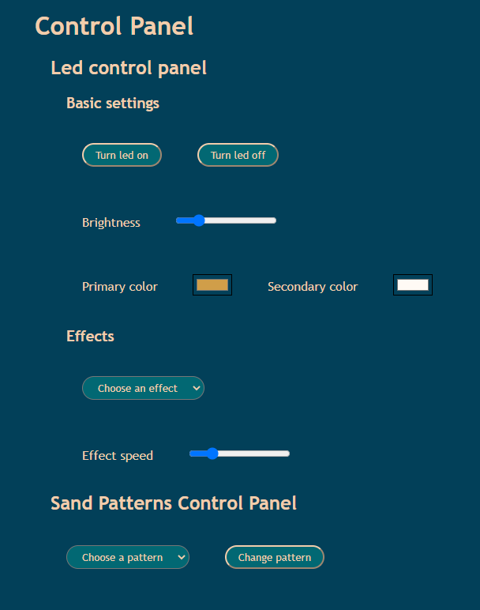

# Drivers

## Firmware


To control the stepper motors we use the gShield v5b which is compatible with an arduino uno.
To get the correct altered firmware on the arduino execute the following steps:
If you cloned this repo go to the 'grbl-library' folder, extract the grbl.zip to C:\Users\[you user]\Documents\Arduino\libraries
Now open Arduino IDE (some newer versions of the IDE may cause trouble to execute the next steps, if trouble occurs I recommend using Arduino IDE 1.8.19)
Go to sketch->Include Library->Add .ZIP library... Now go to documents->Arduino->libraries and select the grbl folder, hit open.
To upload the file go to File->Examples->grbl->grblUpload.
Now you can compile and upload the file.

## End switches

Connect the end switches to the gShield lik in this schematic (you can just ignore the Z-axis).


# Webinterface

## IP Addresses

Static IP address for the PI: 172.16.242.1
Static IP for the LED-strip: 172.16.242.2
Default gateway: 172.16.0.1

## LED connection

When no static IP address has been setup, the connection with the LED-strip had to be setup manually. To do this, follow the steps below:

* Connect the ESP8266 to a PC (or Raspberry Pi) and go to the [WLED install website](https://install.wled.me/).
* Click 'Install' and select the right port in the pop up window and connect.



* Then click "change Wi-Fi" and enter the network name and password and connect
* Then click continue and 'visit device'
* Now the WLED API opens with the default configurations and in the search bar you can find the IP address.



* Copy this IP address into the [script.js file](./static/client/script.js) in the 'const url' variable.

Now you are ready to change the LED effects from this webinterface!

If a static IP address has been set up, the only thing that is left to do is connect the ESP8266 to a power source.

## Client

A simple HTML/JS webpage has been made on which the user can control the functionalities of the Sand Table.



### Led controls

All LED functionality is controlled via the webinterface. The user can turn the LED on or off, choose the brightness, primary and secondary colors, effect and effect speed. The javascript script behind the webpage sends a GET request to the WLED API to change all these parameters.

The led-strip is connected to an [ESP8266](https://en.wikipedia.org/wiki/ESP8266) so that it can be connected to the internet. Then we can send all kinds of GET requests to the WLED API to change the behavior of the LED-strip. Different types of parameters that are added in the URL for the GET request can change the behavior of the LED-strip. An overview of all changeable elements of the LED-strip can be found [here](https://kno.wled.ge/interfaces/http-api/). An overview of all effects to be be set can be found [here](https://github.com/Aircoookie/WLED/wiki/List-of-effects-and-palettes).

### Sand patterns controls

(tbd)

## Server

To initialize FastAPI:

[Source](https://github.com/tiangolo/fastapi)

```pt

pip install fastapi
pip install "uvicorn[standard]"

```

Start server:

When in the webinterface directory:

```pt
uvicorn server.main:app --reload
```

## Docker

To setup docker and docker-compose, run the following commands:

```
curl -sSL https://get.docker.com | sh
sudo adduser <user> docker
sudo systemctl enable docker
sudo systemctl start docker
sudo reboot
```

Test if docker is correctly installed with the `docker --version` command.

Then continue installation of docker  compose with:

```
sudo apt-get install libffi-dev libssl-dev
sudo apt install python3-dev
sudo apt-get install -y python3 python3-pip
curl https://sh.rustup.rs -sSf | sh
source "$HOME/.cargo/env"
rustup update
pip3 install setuptools_rust docker-compose
```

Check if docker-compose is correctly installed with the `docker-compose --version` and `docker ps` commands.

Build with the `docker-compose up --build` command.

Then you can surf to the IP address of the Raspberry Pi and access the webinterface.
